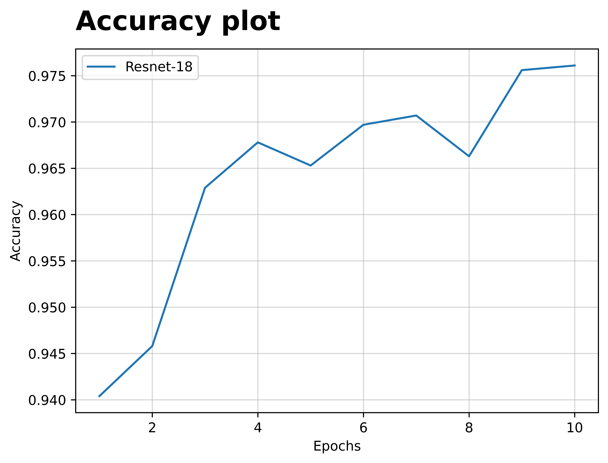

# Periocular Biometrics

In this project, we attempt to leverage the power of convolutional networks specifically resnet-18 in identifying a person's identity through their periocular region.

- [x] Processing the data and creating the ROI's [Click to view](https://github.com/JINO-ROHIT/Clinics_Project/blob/main/notebooks/nb5_ROI.ipynb)
- [x] Training scripts [Click to view](https://github.com/JINO-ROHIT/Clinics_Project/tree/main/scripts)
- [x] Output logs [Click to view](https://github.com/JINO-ROHIT/Clinics_Project/blob/main/artifacts/train.log.txt)
- [x] Out of fold predictions [Click to view](https://github.com/JINO-ROHIT/Clinics_Project/blob/main/artifacts/oof_df.csv)

